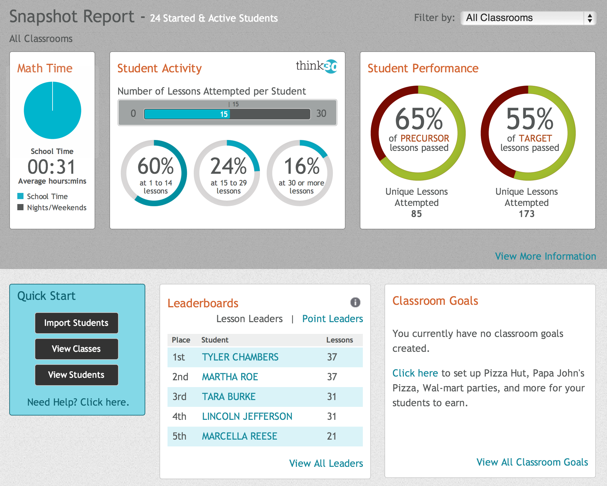

# The Data Warehouse

<pre><!-- Using pre instead of backticks because I can't make backticks stop syntax highlighting. -->
~~~~~~~~~~~~~~~~~~~~~~~~~~~~~~~~~~~~~~~~~~~~~~~~~~~~~~~~~~~~~~~~~~~~~~~~~~~~

             +–––––––––––––+               +–––––––––––––––––+
             |             |    ETL        |                 |
             |             +––––––––––––––>|                 |
             |   Apangea   |               |    Data         |
             |             |               |    Warehouse    |
             |             |<-–––––––––––––+                 |
             |             |    Reports    |                 |
             +–––––––––––––+               +–––––––––––––––––+

~~~~~~~~~~~~~~~~~~~~~~~~~~~~~~~~~~~~~~~~~~~~~~~~~~~~~~~~~~~~~~~~~~~~~~~~~~~~

</pre>

*When there's trouble you call DW!*

---

###  What's a data warehouse,
#### and why do we have one?

A **data warehouse** is a data structure that is optimized for data distribution.

- It makes reporting easier.
- There are performance gains.
- It adds a measure of reliability.


---

### Where in Apangea is data being provided by the data warehouse?

<pre>

~~~~~~~~~~~~~~~~~~~~~~~~~~~~~~~~~~~~~~~~~~~~~~~~~~~~~~~~~~~~~~~~~~~~~~~~~~~~

             +*************+               +–––––––––––––––––+
             *             *    ETL        |                 |
             *             +––––––––––––––>|                 |
             *   Apangea   *               |    Data         |
             *             *               |    Warehouse    |
             *             *<-–––––––––––––+                 |
             *             *    Reports    |                 |
             +*************+               +–––––––––––––––––+

~~~~~~~~~~~~~~~~~~~~~~~~~~~~~~~~~~~~~~~~~~~~~~~~~~~~~~~~~~~~~~~~~~~~~~~~~~~~

</pre>


#### Dashboards




#### Overview Report


#### The Individual Student Pathway Report is **not** driven by warehouse data


#### Outside of Apangea, the Ad-Hoc Portal and TTM Dashboards


---

### What does the data in the data warehouse look like?

<pre>

~~~~~~~~~~~~~~~~~~~~~~~~~~~~~~~~~~~~~~~~~~~~~~~~~~~~~~~~~~~~~~~~~~~~~~~~~~~~

             +–––––––––––––+               +*****************+
             |             |    ETL        *                 *
             |             +––––––––––––––>*                 *
             |   Apangea   |               *    Data         *
             |             |               *    Warehouse    *
             |             |<-–––––––––––––+                 *
             |             |    Reports    *                 *
             +–––––––––––––+               +*****************+

~~~~~~~~~~~~~~~~~~~~~~~~~~~~~~~~~~~~~~~~~~~~~~~~~~~~~~~~~~~~~~~~~~~~~~~~~~~~

</pre>


Our reporting database is made up of **facts** and **dimensions** stored in a **star schema**.


#### What is a fact in a data warehouse?

A **fact** is something that you are trying to measure or count.

A fact table generally has only two types of columns - foreign keys and a number.


```sql
\dt *facts
                          List of relations
 Schema |                 Name                  | Type  |   Owner
--------+---------------------------------------+-------+------------
 public | attempt_facts                         | table | mandybrown
 public | donation_facts                        | table | mandybrown
 public | hint_view_facts                       | table | mandybrown
 public | lesson_attempted_facts                | table | mandybrown
 public | lesson_completed_facts                | table | mandybrown
 public | lesson_passed_facts                   | table | mandybrown
 public | live_help_facts                       | table | mandybrown
 public | placement_test_completed_facts        | table | mandybrown
 public | post_quiz_completed_facts             | table | mandybrown
 public | pre_quiz_completed_facts              | table | mandybrown
 public | precursor_lesson_attempted_facts      | table | mandybrown
 public | precursor_lesson_passed_facts         | table | mandybrown
 public | precursor_post_quiz_completed_facts   | table | mandybrown
 public | precursor_pre_quiz_completed_facts    | table | mandybrown
 public | student_performance_grade_level_facts | table | mandybrown
 public | student_started_facts                 | table | mandybrown
 public | target_lesson_attempted_facts         | table | mandybrown
 public | target_lesson_passed_facts            | table | mandybrown
 public | target_post_quiz_completed_facts      | table | mandybrown
 public | target_pre_quiz_completed_facts       | table | mandybrown
 public | unique_placement_test_facts           | table | mandybrown
```


#### What is a dimension in a data warehouse?

A **dimension** is a way you want to slice the data.

It includes descriptive information about that slice that you might want to show on a report.


```sql
\dt *dimensions
                     List of relations
 Schema |            Name             | Type  |   Owner
--------+-----------------------------+-------+------------
 public | attempt_status_dimensions   | table | mandybrown
 public | classroom_dimensions        | table | mandybrown
 public | customer_dimensions         | table | mandybrown
 public | date_dimensions             | table | mandybrown
 public | district_dimensions         | table | mandybrown
 public | donateable_dimensions       | table | mandybrown
 public | grade_level_dimensions      | table | mandybrown
 public | lesson_reason_dimensions    | table | mandybrown
 public | lesson_result_dimensions    | table | mandybrown
 public | live_help_reason_dimensions | table | mandybrown
 public | math_lesson_dimensions      | table | mandybrown
 public | pathway_dimensions          | table | mandybrown
 public | school_dimensions           | table | mandybrown
 public | standard_dimensions         | table | mandybrown
 public | student_dimensions          | table | mandybrown
 public | teacher_dimensions          | table | mandybrown
 public | time_dimensions             | table | mandybrown
```


#### What is a star schema?
<pre>

                                           +–––––––––+
                   +–––––––––+             | Student |
                   |  Date   |           +-+Dimension|
                   |Dimension+–––+       | +–––––––––+
                   +–––––––––+   |       |
                                 |       |
                               +–+–––––––+-+        +–––––––––+
                               |  Lesson   |        |Classroom|
                               | Completed +––––––––+Dimension|
                        +--––––+   Fact    |        +–––––––––+
                +–––––––+-+    +–––––+–––––+
                |  Math   |          |
                | Lesson  |          |    +–––––––––+
                |Dimension|          +––––+ School  |
                +–––––––––+               |Dimension|
                                          +–––––––––+

</pre>


#### Slowly Changing Dimensions

**Type 1** - Overwrites

**Type 2** - Stores new records

```
 effective_start | timestamp without time zone | default '1970-01-01 00:00:00'::timestamp without time zone
 effective_end   | timestamp without time zone | default '9999-01-01 00:00:00'::timestamp without time zone
 is_latest       | boolean                     | default true
```
Ours are mostly Type 2. In fact, seejee modified the way that ActiveWarehouse-etl handles them...

---

### Getting Data Into The Warehouse

<pre>

~~~~~~~~~~~~~~~~~~~~~~~~~~~~~~~~~~~~~~~~~~~~~~~~~~~~~~~~~~~~~~~~~~~~~~~~~~~~

             +–––––––––––––+               +–––––––––––––––––+
             |             |    ETL        |                 |
             |             +**************>|                 |
             |   Apangea   |               |    Data         |
             |             |               |    Warehouse    |
             |             |<-–––––––––––––+                 |
             |             |    Reports    |                 |
             +–––––––––––––+               +–––––––––––––––––+

~~~~~~~~~~~~~~~~~~~~~~~~~~~~~~~~~~~~~~~~~~~~~~~~~~~~~~~~~~~~~~~~~~~~~~~~~~~~

</pre>


#### What is ETL?

**E**xtract, **T**ransform, **L**oad


#### What's our implementation?

We use the [ActiveWarehouse-ETL](https://github.com/activewarehouse/activewarehouse-etl) gem.

We have scheduled tasks in Scalr:

- Enqueue a Sidekiq job every 3 minutes to do incremental ETL processing
- Overnight we run:

  - database maintenance
  - aggregate
  - process enrollment fixes


#### Incremental Load

For each control file:

1. Data is extracted from Apangea by a query defined in a control file.

  - For facts, this is based off of max id
  - For dimensions, we check the updated timestamps
  - If the data is sharded, it is extracted to a temporary file, which is set to the source

2. Each row is run through necessary **processors** and **transformers** to create a temporary file.

  - Transformers do things like find the surrogate key for a dimension in the warehouse
  - Processors do things like queue unresolved records

3. The resulting csv is bulk imported into the data warehouse.


#### Aggregation

- Every night, aggregate tables are cleared out and repopulated.

- Each fact knows how to aggregate itself.

- This is just for query optimization.

- A few other bits of data that need to be processed regularly are lumped into aggregation:
  - Student deletion
  - Lesson Projection
  - Array Projection
  - Dependent Facts

- The incremental ETL process also does limited aggregation.


#### Initial Load

Similar to incremental load, but with optimizations for loading up a lot of data, and includes archived data.

---

### Back to Apangea

<pre>

~~~~~~~~~~~~~~~~~~~~~~~~~~~~~~~~~~~~~~~~~~~~~~~~~~~~~~~~~~~~~~~~~~~~~~~~~~~~

             +–––––––––––––+               +–––––––––––––––––+
             |             |    ETL        |                 |
             |             +––––––––––––––>|                 |
             |   Apangea   |               |    Data         |
             |             |               |    Warehouse    |
             |             |<**************+                 |
             |             |    Reports    |                 |
             +–––––––––––––+               +–––––––––––––––––+

~~~~~~~~~~~~~~~~~~~~~~~~~~~~~~~~~~~~~~~~~~~~~~~~~~~~~~~~~~~~~~~~~~~~~~~~~~~~

</pre>

*This diagram is a little bit misleading; the warehouse is passive.*


#### Displaying the data in Apangea

- Paul actually wrote up a [very nice decription](https://github.com/thinkthroughmath/apangea/blob/rc/app/assets/javascripts/dashboard/DASHBOARD_WIDGETS.md#what-happens-when-the-fetcher-starts) of how the data is populated in the dashboard.
- Reports are cached in redis.
- You can reset the cache with:
```ruby
rake reporting:clear_cache
```

---


### Let's get dangerous.